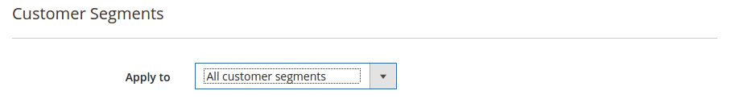
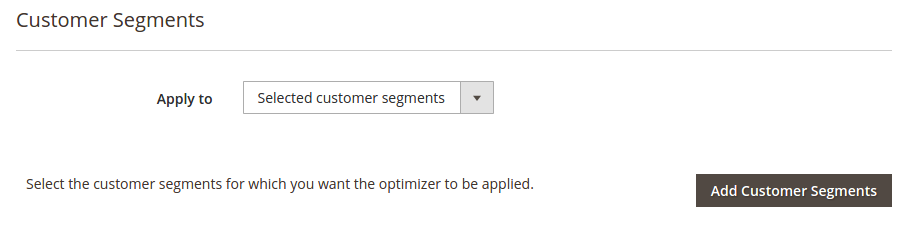
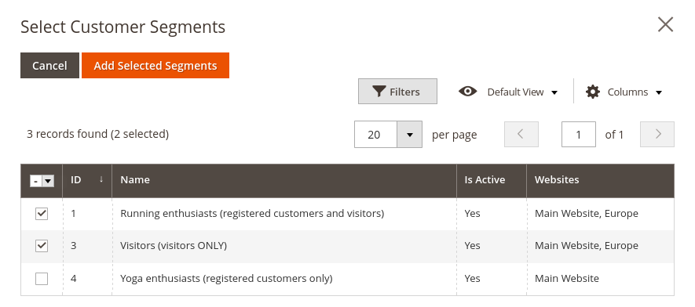
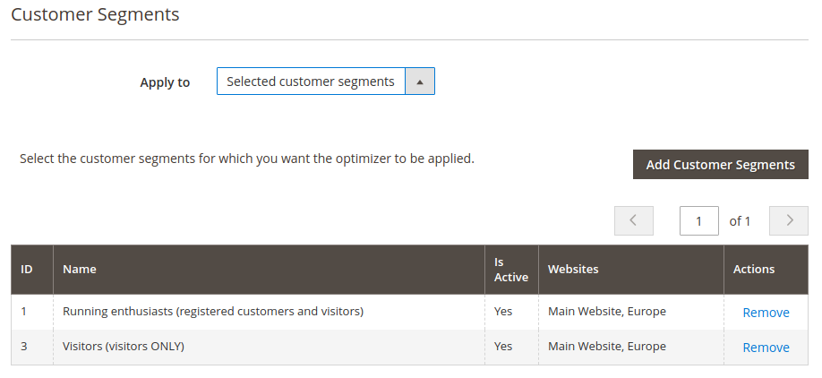
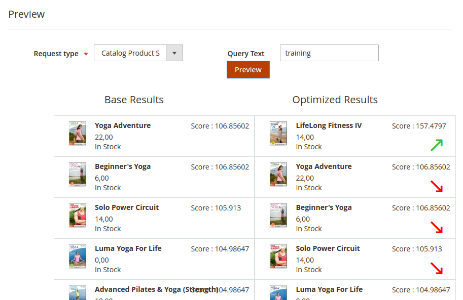

## Customer segments support for search optimizations

This module provides support for the [customer segments](https://docs.magento.com/m2/ee/user_guide/marketing/customer-segments.html) Magento 2 Commerce feature.

It allows you to create search optimizers that are restricted to one or several customer segments.
It supports all types of segments : those applicable to visitors only, registered (and logged in) customers only, or those applicable to both.

For instance, you could imagine
- having created a customer segment corresponding to visitors or registered customers having more than one *running* gear products in their cart
- and then create an optimizer that boosts a series of DVDs dedicated to long distance running.

### Search optimizers edit form changes

If the `Magento_CustomerSegment` module is installed and enabled and the feature enabled in **Stores > Configuration > Customers > Customer Configuration > Customer Segments**, the optimizer edit form will display a new section named **Customer Segments**.

By default, an optimizer will be applied to all customer segments, which means it will be applied to any visitor or registered (and logged in) customer.

#### Selecting one or several segments

Switching the **Apply to** select on **Selected customer segments** displays an **Add Customer Segments** button.

Clicking that buttons opens up a modal window showing a grid of the available customers segments.

After selecting one or more segments, the button **Add Selected Segments** closes the modal window and displays back the optimizer edit form.

Those selected segments are now listed in the **Customer Segments** section in a grid.

After saving the optimizer, it will only be applied to visitors or registered customers matching the corresponding segments, in addition to all other existing conditions or limitations (search terms and/or categories limitation).

#### Search optimizer preview

To simplify things, there are no extra controls for selecting a _preview customer segment_ in the search optimizer preview area.

The search optimizer preview **assumes the customer segment(s) selected are matched**.
